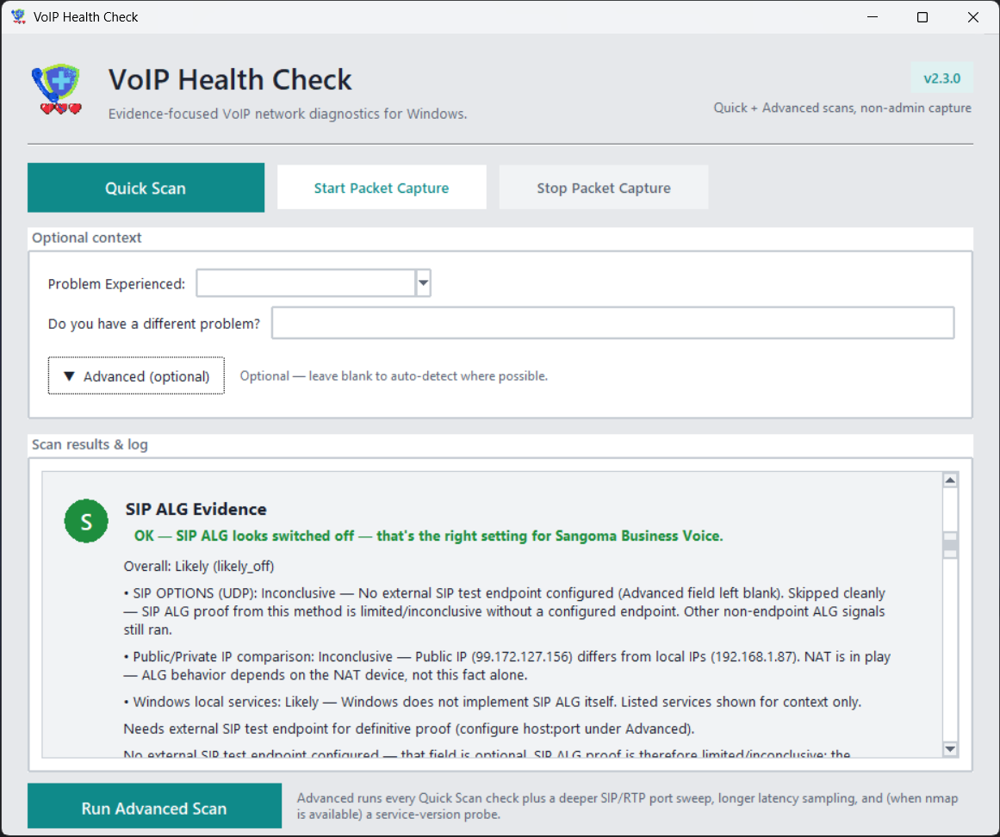

<table>
  <tr><td width="200" align="center">
    
  </td>
  <td>
   <h1>VoIP Health Check</h1>

[](https://python.org)

**Diagnose VoIP problems and security risks with plain-english fixes.** <br>
Scans your PBX/phone system for one-way audio, choppy calls, exposed extensions, and more — then tells you exactly what's wrong and how to fix it.
  </td></tr>
</table>

## What it finds & fixes

| Problem | Likely Cause | Simple Fix |
|---------|--------------|------------|
| **One-way audio** | NAT/firewall blocking RTP | Disable SIP ALG + disable NAT on the internet modem |
| **Choppy audio** | Packet loss or jitter | Prioritize VoIP traffic with QoS (EF marking) |
| **No audio at all** | Codec mismatch | Enable G.711 on FreePBX |
| **Registration fails** | Wrong auth or NAT | Check phone configuration or firmware version |

## Usage
Download the portable desktop client from https://voipscan.danielscience.com
and see results at https://voipscan.danielscience.com/dashboard

## Desktop client (Windows)

<p align="center">
  
</p>

The desktop client is a portable Windows GUI titled **VoIP Health Check —
Local network diagnostics for VoIP health**. The screenshot above shows the
main window:

- A red **Quick Scan** button and a neighbouring **Start Packet Capture**
  button along the top action row, both sized and spaced to match — the
  packet-capture flow now has a dedicated **Stop Packet Capture** button
  beside Start so the operator can finalize a capture without relying on
  a single toggle.
- An **Optional** card with a *Problem Experienced* dropdown, a *Do you
  have a different problem?* free-text field, an *Advanced* (collapsible)
  panel where every field is optional and auto-detected when blank, and
  a red **Scan Now** button.
- A dark **Scan Results / Log** pane that streams diagnostic lines
  during a scan and switches to a plain-English summary (with status
  badges) when the scan finishes. The screenshot shows the idle state
  with the app version banner, the local logs path, and the resolved
  `nmap.exe` path.

### Download the Windows client

**Permanent download location:** the
[**GitHub Releases page**](https://github.com/RyanDanielWillis/voip-health/releases)
for this repo. Each release is published by the
[*Release LocalScanner Windows EXE*](https://github.com/RyanDanielWillis/voip-health/actions/workflows/release-localscanner.yml)
workflow and ships the same self-identifying package described below.
Releases never expire — prefer them over Actions artifacts when sharing
a download link with end users.

To install the latest release:

1. Open the [**Releases page**](https://github.com/RyanDanielWillis/voip-health/releases)
   and pick the newest `localscanner-v<version>` release (or
   [download the latest directly](https://github.com/RyanDanielWillis/voip-health/releases/latest)).
2. Under **Assets**, download
   `VoIPHealthCheck-windows-package-<version>.zip` (recommended — exe
   plus bundled `nmap/`, `BUILD_INFO.txt`, `VERSION.txt`, README) or the
   standalone `VoIPHealthCheck-<version>.exe`.
3. Unzip into a fresh folder (e.g. `C:\Tools\VoIPHealthCheck-2.2.0\`)
   and run `VoIPHealthCheck-<version>.exe` — no installer required. (The
   unversioned `VoIPHealthCheck.exe` next to it is byte-identical and
   exists so existing shortcuts keep working; the versioned name makes
   the build obvious at a glance.)

> **Dev / pre-release builds.** The
> [`build-localscanner.yml`](https://github.com/RyanDanielWillis/voip-health/actions/workflows/build-localscanner.yml)
> workflow still publishes per-commit binaries as Actions
> *workflow-run artifacts*. Those are useful for testing an unreleased
> change but expire after GitHub's retention window and require
> navigating the Actions UI — they are **not** the recommended download
> path for end users. Releases are.

`.exe` and `.zip` files are intentionally **not** committed to the
repository. The release workflow is the source of truth so the
published binary always tracks a specific commit.

The hosted homepage at https://voipscan.danielscience.com also surfaces
the same screenshot, copy and download instructions for end users.

### Troubleshooting: scan appears to hang / shows wrong version

The 2.2.0 build replaced the legacy broad nmap sweep with the **Safe
Quick Scan profile**. On startup the client now logs:

```
VoIP Health Check LocalScanner version 2.2.0 starting (build: Safe Quick Scan profile)
Executable: <full path to running exe> (frozen=True)
Working directory: <full path>
App root: <full path>
Build info: <path>\BUILD_INFO.txt
[safe] Safe Quick Scan profile active ...
```

The CI distribution package is now self-identifying — alongside
`VoIPHealthCheck.exe` you will find a versioned `VoIPHealthCheck-2.2.0.exe`,
a `BUILD_INFO.txt` (version, build tag, git SHA, workflow run id, UTC
build timestamp) and a `VERSION.txt`. **Prefer launching the versioned
exe** so the file name itself confirms the build.

If your log shows version `2.0.0`, an old `Running Quick Scan: ...
192.168.1.0/24 192.168.41.0/24 ...` line, or no `Executable:` /
`Working directory:` lines at all, you are running an **old
executable** — most often a stale shortcut to a `VoipScanner_Desktop`
folder from a previous install. To recover:

1. Delete the old `VoipScanner_Desktop` folder and any desktop / Start
   Menu shortcuts that point at it.
2. Download the latest `VoIPHealthCheck-windows-package-<version>.zip`
   from the
   [Releases page](https://github.com/RyanDanielWillis/voip-health/releases/latest)
   (the *Release LocalScanner Windows EXE* workflow publishes it).
3. **Extract the zip to a fresh folder** (e.g.
   `C:\Tools\VoIPHealthCheck-2.2.0\`). Do not extract on top of an
   older folder.
4. Launch `VoIPHealthCheck-2.2.0.exe` and confirm the startup banner
   reads `version 2.2.0` and the `Executable:` line points at the new
   folder.

See [LocalScanner/README.md](LocalScanner/README.md#troubleshooting-scan-never-completes--quick-scan-hangs)
for the full procedure.

## Output:
🔍 SCANNING 192.168.1.100...
❌ ONE-WAY AUDIO DETECTED
Cause: RTP ports 10000-20000 blocked by firewall
Fix: Open UDP 10000-20000 + enable SIP ALG

✅ SIP SECURE: ACLs configured correctly

## Features
- **Network diagnostics**: Ping, traceroute, jitter tests
- **SIP enumeration**: svmap + custom probes
- **Security scan**: Open ports, weak auth, container vulns
- **Root cause analysis**: 20+ job-tested rules
- **Pipeline ready**: SARIF output for GitHub Actions
- **Non-technical reports**: HTML + plain English

## Demo
https://voipscan.danielscience.com

## Server / dashboard

The Flask app under `web/` ingests scans uploaded by the desktop client
and surfaces them on a real-time dashboard. Key endpoints:

| Endpoint | Purpose |
|----------|---------|
| `POST /api/v2/scan/upload` | JSON `ScanReport` upload (auto-called by client) |
| `POST /api/v2/scan/<id>/artifact` | Multipart upload (raw log, capture file) for a scan |
| `POST /api/v2/capture/upload` | Standalone capture upload (no scan id) |
| `GET  /api/v2/scan/<id>/report.json` | Download canonical scan JSON |
| `GET  /api/v2/artifact/<id>/download` | Download raw artifact file |
| `GET  /scan/<id>` | Per-scan detail page with KPIs, issues, ports, downloads |
| `GET  /dashboard` | Aggregate KPIs + latency / jitter trend chart |

### Optional upload token

Set `VOIPSCAN_UPLOAD_TOKEN` on the server to require an
`Authorization: Bearer <token>` header on every upload. Comparison uses
`hmac.compare_digest` so it's safe against timing attacks. The desktop
client picks up the matching token from the `VOIPSCAN_UPLOAD_TOKEN` env
var or from `~/.config/voipscan/upload.json` (`%LOCALAPPDATA%\VoipScan\upload.json`
on Windows).

### One-time DB reset (Phase 2)

The new analytics schema lives in `web/db.py`. On the first deploy under
schema version 2 the previous `audit_data.db` (single `audits` JSON blob)
is **automatically backed up** to `audit_data.db.legacy_<timestamp>.bak`
next to the original file, dropped, and recreated with the new tables.
Subsequent restarts of `gunicorn` (and `update.py` re-runs) are no-ops:
the version row records that the reset has already happened, so nothing
gets wiped on every deploy.

The artifact directory defaults to `~/voipscan_api/artifacts/` and can
be overridden with `VOIPSCAN_ARTIFACT_DIR`.

## Documentation

The hosted Flask app exposes a full reference at
[`/docs`](https://voipscan.danielscience.com/docs). The same page is rendered
from `web/templates/docs.html` and is the canonical, in-product
documentation for end users, technicians, and reviewers.

### Keeping documentation in sync

Whenever a change touches the desktop client, REST API, schema,
diagnostics modules, deployment story, or security model, update the
documentation in the **same pull request**. The page and this README are
designed to drift together.

Quick checklist:

- [ ] **New REST endpoint** — add a row in the docs page *Backend &
  database* section and (if user-visible) in the README API table.
- [ ] **New diagnostics module** — add a bullet in the docs page
  *Evidence collection* and *Diagnostics* sections.
- [ ] **Schema / database change** — refresh the schema list in the docs
  page and the legacy-reset notes here.
- [ ] **Auth / security change** — update the docs *Security model*
  section.
- [ ] **New environment variable / deployment step** — update the docs
  *Deployment & operations* section.
- [ ] **GUI change** — refresh the docs *Desktop client* section and the
  `client_gui.png` screenshot in this README.
- [ ] **Version bump** — update the troubleshooting banner text in both
  this README and the docs *Troubleshooting* section.

## Why it exists
Built from real VoIP troubleshooting pain. Tired of "reboot router" answers? This tells you *exactly* what's broken and how to fix it.

⭐ **Star if it saves you a call to support!**
